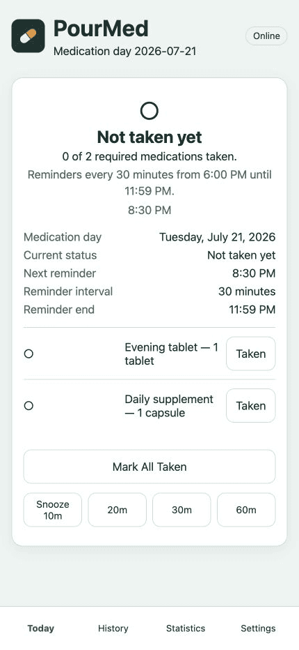
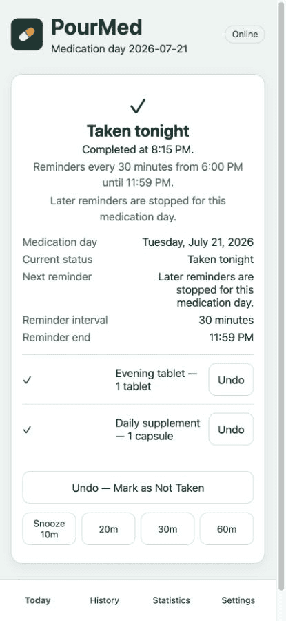
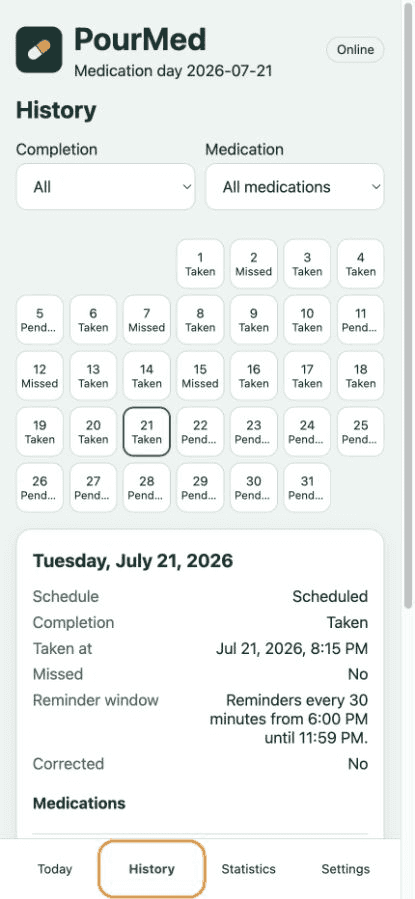
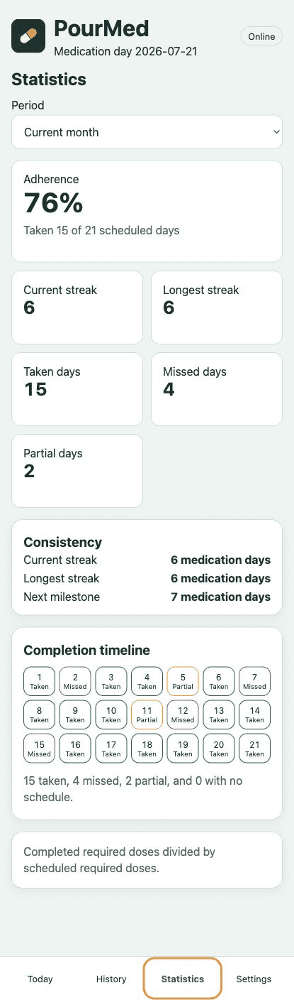
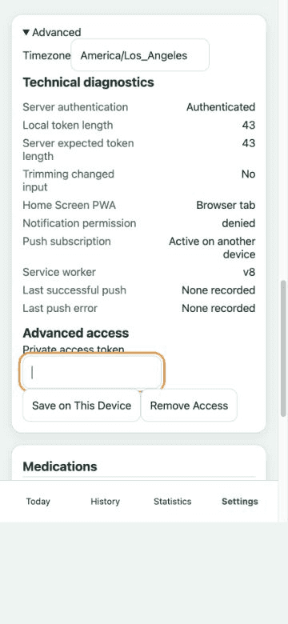
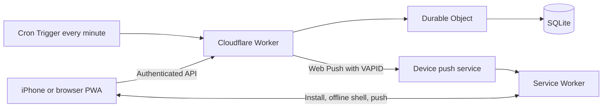

# PourMed

A privacy-first, self-hosted medication reminder PWA built on Cloudflare.

PourMed is a single-user application that you deploy to your own Cloudflare account. Medication records stay in that deployment: the maintainer does not provide a shared hosted service, and this public repository contains no production credentials or personal medication data.

[](https://github.com/pour-soi/PourMed/releases)
[](https://github.com/pour-soi/PourMed/actions/workflows/ci.yml)
[](LICENSE)


## Screenshots

All screenshots come from an isolated local PourMed instance with synthetic medications, history, credentials, and push-subscription data. No production deployment or personal data was used.

| Ready for the evening routine                                                                               | Medication day completed                                                                               |
| ----------------------------------------------------------------------------------------------------------- | ------------------------------------------------------------------------------------------------------ |
|  |  |

| History                                                                                                      | Statistics                                                                                                      |
| ------------------------------------------------------------------------------------------------------------ | --------------------------------------------------------------------------------------------------------------- |
|  |  |

### Notification diagnostics



See the [screenshot safety record](docs/images/README.md) for the capture constraints.

## Features

- Recurring, timezone-aware medication reminders
- Web Push notifications
- iPhone Home Screen PWA support
- Immediate and delayed notification testing
- Secure access-token authentication
- Medication history and plain-text notes
- Period-based adherence statistics
- Current and longest streak tracking
- Offline application shell
- Self-hosted Cloudflare deployment

## Important platform behavior

- iPhone Web Push requires iOS 16.4 or later and installation on the Home Screen.
- Notification permission must be requested from the installed PWA, not a normal Safari tab.
- Notifications may be presented on a paired Apple Watch instead of the locked iPhone, depending on Apple's notification routing.
- Web Push is best effort; connectivity and subscription expiry can delay or prevent delivery.
- Focus modes and system notification settings control when and where notifications appear.

## Architecture



- **Cloudflare Workers** serve the application and authenticated JSON API.
- **Durable Objects with SQLite** serialize state changes and store the single-user data set.
- **Cron Triggers** check reminder eligibility once per minute; stored slots prevent duplicates.
- **Service Worker** handles installation, offline shell caching, controlled updates, and push events.
- **Web Push** uses deployment-specific VAPID keys.
- **TypeScript** is shared across the client, Worker, domain logic, and tests.

Private `/api/` responses are never cached by the service worker.

## Privacy and security model

- Every user deploys an independent instance and generates independent secrets.
- Medication records, settings, and push-subscription state remain in that user's Durable Object.
- All protected APIs enforce bearer-token authentication on the server.
- The Worker stores a SHA-256 token verifier, not the original access token.
- This project is not a shared public SaaS instance and includes no analytics or third-party runtime scripts.
- Deployment owners are responsible for securing their Cloudflare account, device, and access token.

> **Never commit tokens or secrets.** Keep `.dev.vars`, `secrets/`, access tokens, VAPID private keys, Cloudflare credentials, databases, exports, and private logs out of Git.

See [Privacy](PRIVACY.md) and [Security](SECURITY.md).

## Requirements

- A Cloudflare account with Workers and Durable Objects available
- Node.js 22 or later, as required by `package.json`
- npm/Corepack for installing pnpm; this repository uses pnpm and `pnpm-lock.yaml`
- Wrangler, installed as a project dependency and run through `pnpm wrangler`
- Git
- For iPhone Web Push: iOS 16.4 or later and a Home Screen installation

## Quick start

1. Clone and install the project.

   ```sh
   git clone https://github.com/pour-soi/PourMed.git
   cd PourMed
   corepack enable
   pnpm install --frozen-lockfile
   ```

2. Authenticate Wrangler to your own Cloudflare account.

   ```sh
   pnpm wrangler login
   pnpm wrangler whoami
   ```

3. Review `wrangler.jsonc`. It already declares the static-assets binding, SQLite Durable Object, one-minute Cron Trigger, and default timezone variable. Change the Worker `name` if needed; do not add an Account ID or credentials.

4. Generate a high-entropy access token and Web Push keys. Private values are written to ignored, mode-600 files and are not printed.

   ```sh
   pnpm secrets:generate
   ```

5. Open `secrets/wrangler-secrets.env` in a local editor and add your VAPID contact subject, for example `VAPID_SUBJECT=mailto:you@example.com`. Keep the file private. Then verify and deploy the first Worker version with that secrets file.

   ```sh
   pnpm verify
   pnpm exec wrangler deploy --secrets-file secrets/wrangler-secrets.env
   ```

6. Open the generated URL, such as `https://your-project.workers.dev`. On iPhone, choose **Share → Add to Home Screen**, launch the installed app, enter the token from `secrets/access-token.txt`, and tap **Enable Notifications**.

See the [complete deployment guide](docs/DEPLOYMENT.md) before deploying.

## Configuration reference

| Name                  | Kind                   | Visibility           | Purpose                                                                                            |
| --------------------- | ---------------------- | -------------------- | -------------------------------------------------------------------------------------------------- |
| `ACCESS_TOKEN_HASH`   | Worker secret          | Private              | Base64url SHA-256 verifier for the device access token                                             |
| `ACCESS_TOKEN_LENGTH` | Worker secret          | Private metadata     | Expected untrimmed token length used by safe authentication diagnostics                            |
| `VAPID_PUBLIC_KEY`    | Worker secret          | Public key material  | Public P-256 key returned to authorized clients for Web Push subscription                          |
| `VAPID_PRIVATE_KEY`   | Worker secret          | Private              | P-256 private key used to sign Web Push requests                                                   |
| `VAPID_SUBJECT`       | Worker secret          | Public contact value | VAPID contact URI, for example `mailto:you@example.com`                                            |
| `TIME_ZONE`           | Wrangler variable      | Public configuration | Deployment default declared as `America/Los_Angeles`; schedule timezone is configurable in the app |
| `ASSETS`              | Worker binding         | Public configuration | Serves the Vite production bundle from `dist/`                                                     |
| `MEDICATION_STATE`    | Durable Object binding | Public configuration | Binds the `MedicationState` class and its single-user SQLite storage                               |

`wrangler.jsonc` exports `MedicationState` as a SQLite-backed Durable Object. Application schema upgrades are additive and run inside that object; see [Migrations](docs/MIGRATIONS.md). The Cron expression is `* * * * *` and only checks eligibility—configured schedule and stored reminder slots determine whether anything is sent.

## Local development

Use disposable local credentials only. Copy the example file, replace every placeholder with local-only values, then start Vite:

```sh
pnpm install --frozen-lockfile
cp .dev.vars.example .dev.vars
pnpm dev
```

The generated `secrets/wrangler-secrets.env` shows the required local value format. Never copy production values into a development fixture or commit `.dev.vars`.

## Testing

```sh
pnpm test                    # all Vitest tests
pnpm lint                    # ESLint
pnpm typecheck               # browser and Worker TypeScript targets
pnpm exec vite build         # production client build
pnpm exec wrangler deploy --dry-run --outdir dist-worker
pnpm secret:scan             # tracked and untracked source credential scan
pnpm audit --prod            # production dependency audit
pnpm verify                  # complete local gate, including coverage and assets
```

The Wrangler dry run does not deploy and requires no Cloudflare credentials. See [Testing](docs/TESTING.md).

## Updating

After deploying a new version, the browser installs the updated service worker in the background. When a worker is waiting, PourMed displays **An update is available**. Tap **Update Now** to send `SKIP_WAITING`; the new worker activates, claims the page, reloads it, and hides the banner. If no worker is waiting, the button remains hidden.

## Troubleshooting

| Problem                             | Checks                                                                                                                                                                                                                    |
| ----------------------------------- | ------------------------------------------------------------------------------------------------------------------------------------------------------------------------------------------------------------------------- |
| Token rejected                      | Copy the complete token from your local `secrets/access-token.txt`, save it again, and compare the safe token-length diagnostics. Confirm your Worker has matching `ACCESS_TOKEN_HASH` and `ACCESS_TOKEN_LENGTH` secrets. |
| Notification permission unavailable | Use iOS 16.4+ and launch the installed Home Screen PWA. Permission cannot be requested from an ordinary Safari tab.                                                                                                       |
| Push subscription inactive          | Confirm authentication succeeds, permission is granted, a service worker is registered, and the three VAPID values belong to this deployment. Then refresh the subscription.                                              |
| Notification appears on Apple Watch | This can be normal Apple notification routing when an iPhone is locked and paired with a watch. Check notification settings on both devices.                                                                              |
| Stale PWA interface                 | Fully close and reopen the Home Screen app, confirm connectivity, and inspect the service-worker version shown in diagnostics.                                                                                            |
| **Update Now** does not appear      | No update is waiting. Deploy a newer bundle, reopen the app online, and allow the new worker to finish installing.                                                                                                        |
| Reminders do not fire               | Confirm reminders are enabled, the schedule includes the current medication day, required medication is incomplete, the push subscription is active, and the Cron Trigger exists.                                         |
| Timezone or Cron confusion          | Cron runs every minute in UTC, but reminder eligibility uses the IANA timezone saved in app settings and a 07:00 medication-day boundary. Do not convert the Cron expression to a fixed local offset.                     |

## Medical disclaimer

PourMed is a reminder and tracking tool, not medical advice, a medical device, or an emergency system. Do not rely on it as the sole safeguard for critical medication. Push delivery can fail or be delayed. Never take an extra dose solely because the application state is uncertain; contact a clinician or pharmacist for dosing questions and local emergency services for emergencies.

## License

PourMed is available under the [MIT License](LICENSE).

## Contributing and security

Contributions are welcome. Read [CONTRIBUTING.md](CONTRIBUTING.md) and the [Code of Conduct](CODE_OF_CONDUCT.md) before opening a pull request. Report vulnerabilities according to [SECURITY.md](SECURITY.md), never through a public issue containing exploit details or private data.
