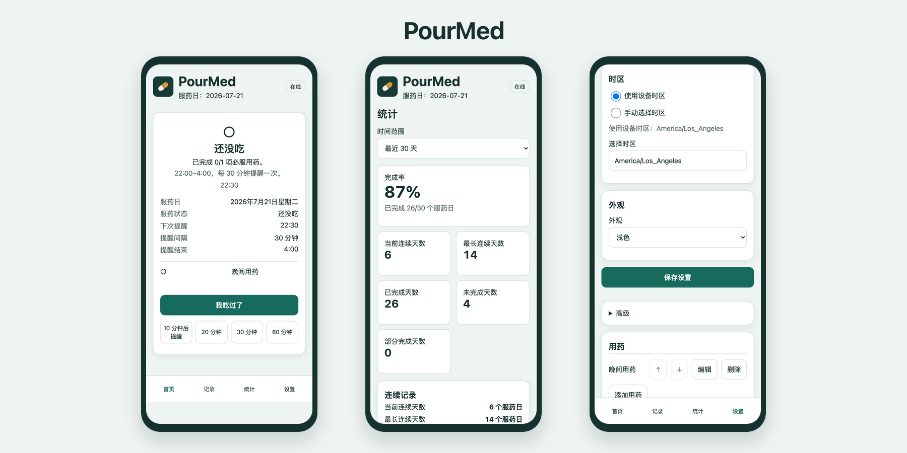
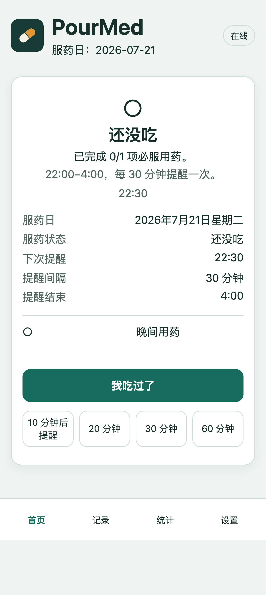
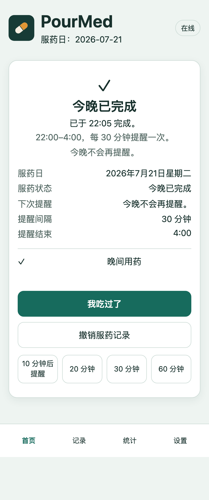
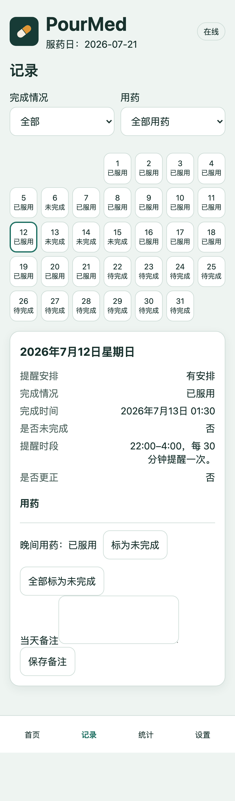
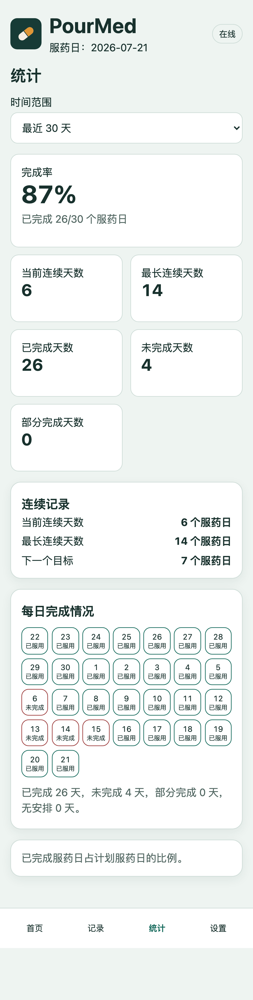
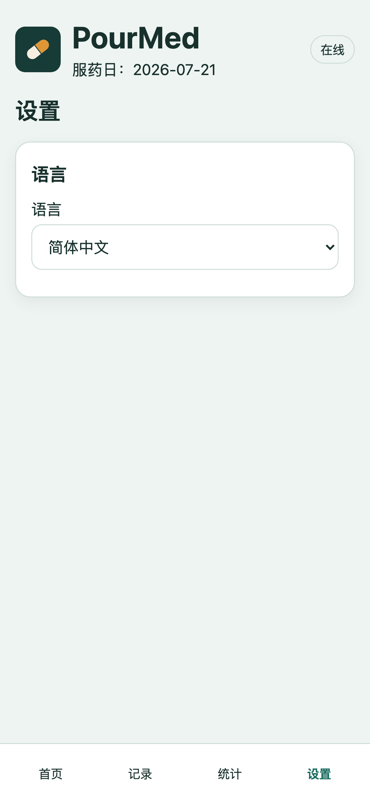
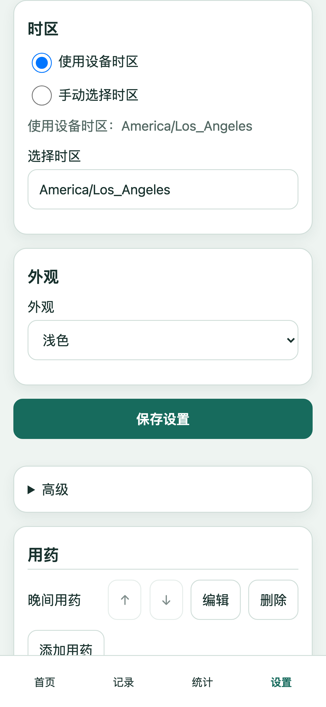
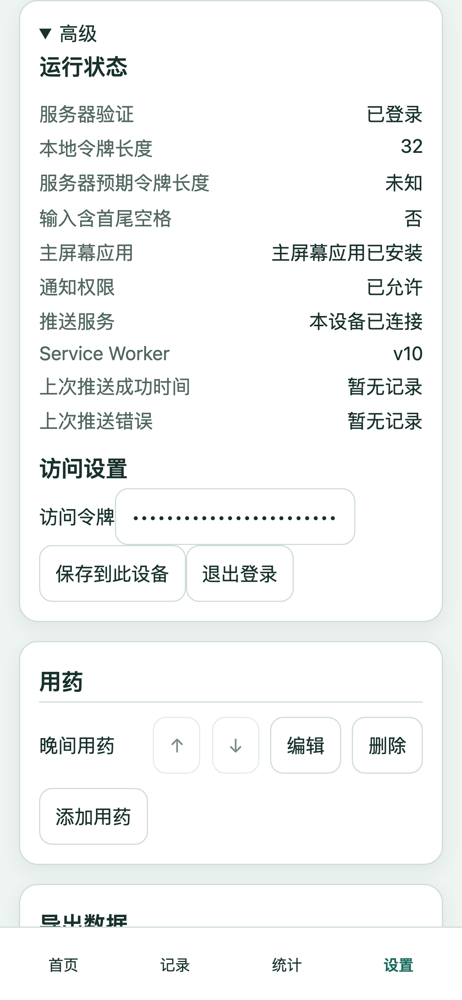
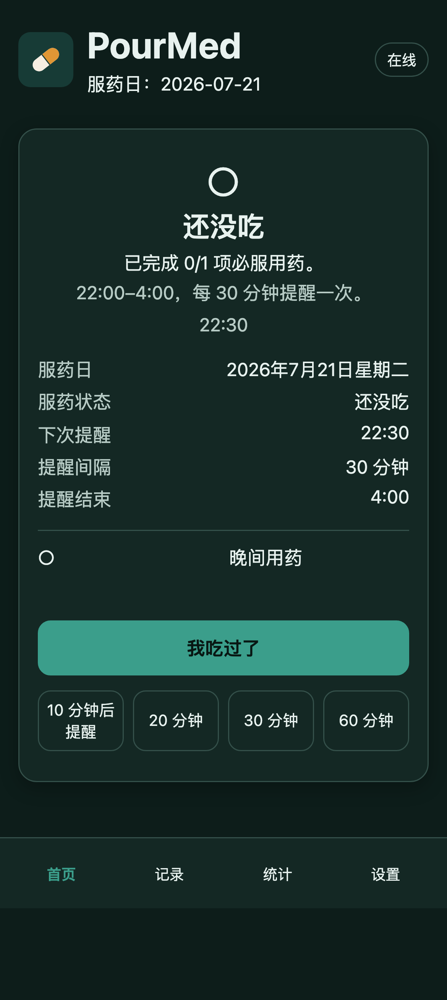

# PourMed

[English](README.md) | 简体中文

PourMed 是一款注重隐私、可自行部署的服药提醒 PWA，运行在 Cloudflare 上。

<p align="center">
  
</p>

PourMed 是单用户应用。你需要将它部署到自己的 Cloudflare 账户，服药记录只保存在你自己的部署中。本仓库不提供共享服务，也不包含生产凭据或个人服药数据。

## 主要功能

- 按设定时间重复发送服药提醒
- Web Push 通知和 iPhone 主屏幕 PWA
- 英文和简体中文界面，可在应用内即时切换
- 自动检测设备时区，也可手动选择标准时区
- 服药记录、备注、更正和数据导出
- 完成率、当前连续天数、最长连续天数和每日完成情况
- 安全的访问令牌验证
- 离线应用外壳和可控的 Service Worker 更新
- 部署到自己的 Cloudflare Worker

## 服药提醒

<table>
  <tr>
    <td width="50%" align="center"><br /><sub>待完成</sub></td>
    <td width="50%" align="center"><br /><sub>已完成</sub></td>
  </tr>
</table>

提醒时段可以在设置中调整。默认示例为晚上 10:00 到凌晨 4:00，每 30 分钟提醒一次。每天早上 7:00 开始新的服药日，因此凌晨的提醒和记录仍属于前一个服药日。

## 记录和统计

<table>
  <tr>
    <td width="50%" align="center"><br /><sub>服药记录</sub></td>
    <td width="50%" align="center"><br /><sub>完成率和连续记录</sub></td>
  </tr>
</table>

统计可按本月、最近 30 天、最近 90 天、今年或全部记录查看。切换语言只改变显示方式，不会改变日期归属、记录顺序或统计数值。

## 语言设置

在“设置 → 语言”中选择 `English` 或 `简体中文`。切换立即生效，无需重新加载。选择结果保存在设备上，关闭或更新 PWA 后仍会保留。

首次使用时，设备语言为 `zh`、`zh-CN` 或 `zh-SG` 会选择简体中文；其他语言使用英文。为避免向繁体中文用户显示未经选择的简体中文，`zh-TW` 和 `zh-HK` 目前使用英文。手动选择后，浏览器语言变化不会覆盖你的选择。

<p align="center">
  
</p>

## 时区

自动模式使用当前设备的时区；手动模式可将提醒固定在所选地区。夏令时会自动调整。更改时区只影响今后的提醒，不会改写已有记录；更改语言也不会改变时区。

<p align="center">
  
</p>

## 通知和安装要求

- iPhone Web Push 需要 iOS 16.4 或更高版本。
- 必须先在 Safari 中选择“分享 → 添加到主屏幕”，再从主屏幕打开 PourMed。
- 通知权限需要从已安装的 PWA 中申请。
- 语言切换不会重新订阅通知，也不会发送测试通知。
- 网络、专注模式、系统通知设置或订阅失效都可能影响送达。

<table>
  <tr>
    <td width="50%" align="center"><br /><sub>通知状态</sub></td>
    <td width="50%" align="center"><br /><sub>深色模式</sub></td>
  </tr>
</table>

## 隐私和安全

- 服药记录存放在你自己的 Cloudflare Durable Object 和 SQLite 中。
- 访问令牌、VAPID 私钥和 Cloudflare 凭据必须通过 Secret 配置，绝不能提交到 Git。
- 导出文件不包含访问凭据或推送服务详情。
- 本项目不包含分析、跟踪或外部翻译服务。

> **绝不要提交令牌或 Secret。** 请将 `.dev.vars`、`secrets/`、访问令牌、VAPID 私钥、数据库导出和私人日志保留在 Git 之外。

PourMed 是个人提醒工具，不提供医疗建议。请勿仅因应用显示的状态不确定而额外服药；如有疑问，请咨询医生或药师。

## 自行部署

需要准备 Node.js 22 或更高版本、pnpm 11、Wrangler 和自己的 Cloudflare 账户。

```sh
git clone https://github.com/pour-soi/PourMed.git
cd PourMed
corepack enable
pnpm install --frozen-lockfile
pnpm exec wrangler login
pnpm secrets:generate
```

在本地打开 `secrets/wrangler-secrets.env`，配置 VAPID 联系方式，然后按照 [部署指南](docs/DEPLOYMENT.md) 将 Secret 写入自己的 Worker 并部署。部署完成后，打开你自己的地址，例如 `https://your-project.workers.dev`。不要使用他人的部署或访问令牌。

## 本地开发

```sh
pnpm install --frozen-lockfile
pnpm dev
```

完整验证：

```sh
pnpm verify
```

重新生成英文和中文截图：

```sh
pnpm exec playwright install chromium
pnpm screenshots
```

截图由真实客户端和固定的虚构数据生成，不会连接生产环境。详细记录见 [截图安全与生成说明](docs/images/README.md)。

## 架构

- Cloudflare Worker：API、静态资源和定时任务入口
- Durable Objects + SQLite：设置、服药记录和提醒去重
- Service Worker：安装、离线外壳、更新和推送事件
- Web Push：使用每个部署自己的 VAPID 密钥
- TypeScript：客户端、Worker、领域逻辑和测试

## 许可证

本项目采用 [MIT License](LICENSE)。
